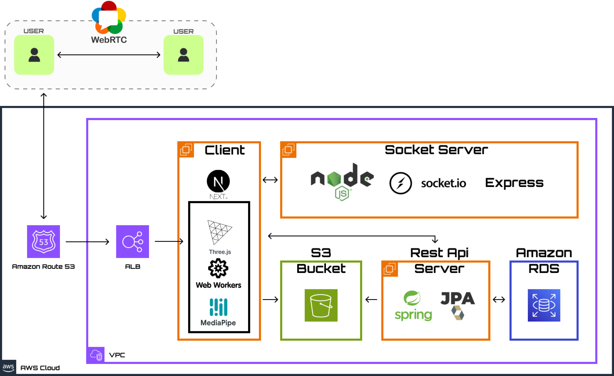

 

## 목차

1. [**프로젝트 개요**](#프로젝트-개요)
2. [**서비스 소개**](#서비스-소개)
3. [**아키텍쳐**](#아키텍쳐)
4. [**프로젝트 포스터**](#프로젝트-포스터)

 
 

## 프로젝트 개요

프로젝트 기간 : **2024.06.20 ~ 2024.07.27 (5주)**

팀원 : [**전병준**](https://github.com/jun9898) (BE), [**정승호**](https://github.com/seungho-jg) (FE), 
[**박유주**](https://github.com/youjuice) (FE), [**김태욱**](https://github.com/twk00) (FE,BE)

#### 기술 스택
| 분류 | 기술                                                                                                                                                                                                                                                                                                                                                                                                                                                        | 
|-----|-----------------------------------------------------------------------------------------------------------------------------------------------------------------------------------------------------------------------------------------------------------------------------------------------------------------------------------------------------------------------------------------------------------------------------------------------------------|
|**Frontend**|      |
|**Backend**|                                                                                                                        |
|**Database**|                                                                                                                                                                                                                                       |
|**Infra/Devops**|     |

 
 

## 서비스 소개

서비스 소개 영상 : [바로가기]()

🍀 [**PLAY ROCKI-BIKI!**](https://rocki-biki.com/)

 

## 아키텍쳐

 

## 프로젝트 포스터

.png)
